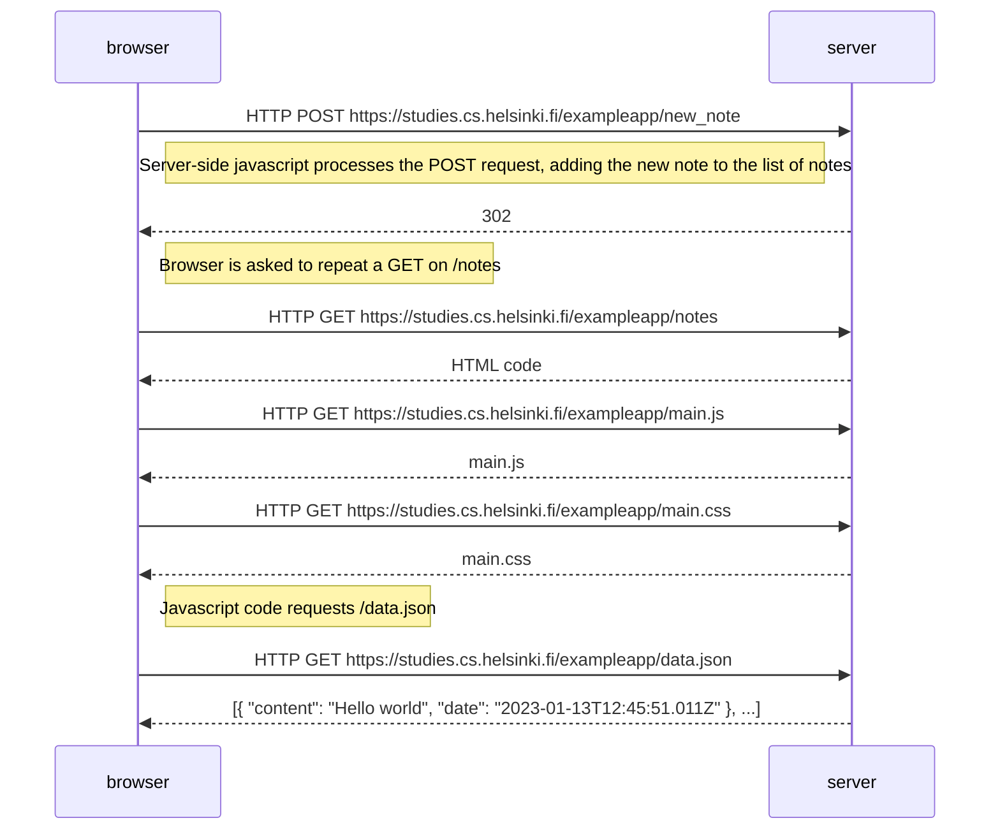

Sequence diagram for a user submitting a new note to https://studies.cs.helsinki.fi/exampleapp/notes

```mermaid
sequenceDiagram
  participant browser
  participant server
  browser->>server: HTTP POST https://studies.cs.helsinki.fi/exampleapp/new_note
  Note left of server: Server-side javascript processes the POST request, adding the new note to the list of notes
  server-->>browser: 302
  Note right of browser: Browser is asked to repeat a GET on /notes
  browser->>server: HTTP GET https://studies.cs.helsinki.fi/exampleapp/notes
  server-->>browser: HTML code
  browser->>server: HTTP GET https://studies.cs.helsinki.fi/exampleapp/main.js
  server-->>browser: main.js
  browser->>server: HTTP GET https://studies.cs.helsinki.fi/exampleapp/main.css
  server-->>browser: main.css
  Note right of browser: Javascript code requests /data.json
  browser->>server: HTTP GET https://studies.cs.helsinki.fi/exampleapp/data.json
  server-->>browser: [{ "content": "Hello world", "date": "2023-01-13T12:45:51.011Z" }, ...]
```
